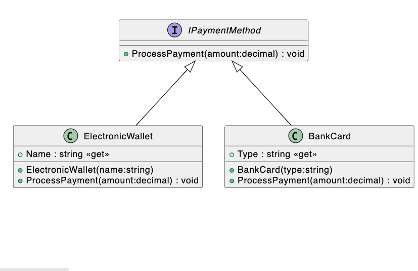

## Электронная система продажи билетов на междугородние маршруты

Платформа для продажи электронных билетов на междугородние автобусные поездки и получения онлайн-платежей за проезд. Покупатель самостоятельно распечатывает билеты для предъявления перед отправкой. Оплатить билет можно из-за рубежа РФ. Доступна покупка поездок «туда-обратно», включая пересадки и использование абонементов. Обновление таблиц в режиме реального времени.

Реализация проездных документов для людей с ограниченными возможностями не требует посещения кассы: средства можно перевести на выбор через SMS, электронные кошельки или банковские карты. Данные электронных расчетов интегрированы с бухгалтерией компании.

# Прототип программной модели 

В данном прототипе спроектируем как можно подробнее следующие классы:

1. Класс TicketSystem - представляет систему продажи билетов, содержит список доступных маршрутов и методы для просмотра маршрутов и покупки билетов.
1. Класс Route - представляет маршрут, содержит информацию о пункте отправления, пункте назначения, дате и времени отправления, а также цене билета.
1. Класс Ticket - представляет билет, содержит информацию о выбранном маршруте и количестве билетов. Имеет методы для расчета итоговой стоимости и печати билета.
1. Класс PaymentSystem - представляет систему платежей, содержит список доступных способов оплаты и методы для добавления и выбора способа оплаты.
1. Интерфейс IPaymentMethod - определяет контракт для классов, представляющих способы оплаты. Имеет метод ProcessPayment для обработки платежа.
1. Классы ElectronicWallet и BankCard - реализуют интерфейс IPaymentMethod и представляют конкретные способы оплаты (электронный кошелек и банковская карта).

Итоговые уточненные диаграммы классов и интерфейса будут выглядеть следующим образом:

### Протестируем консольный интерфейс системы

